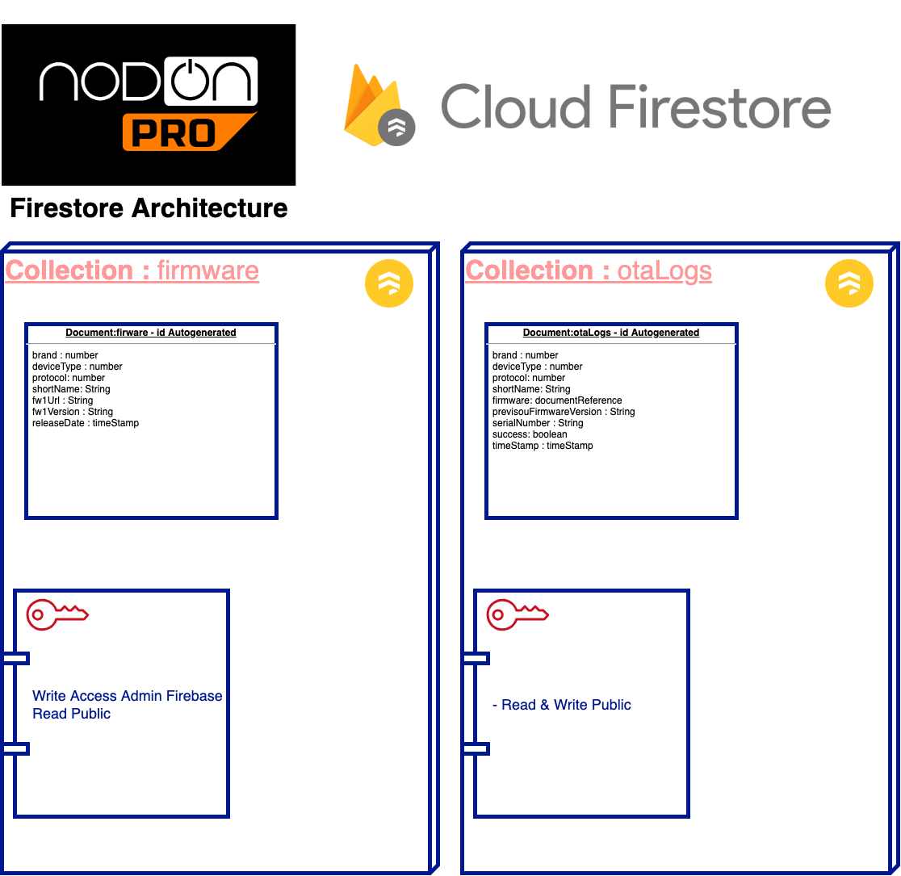

# SPECIFICATIONS 

This document gives an overview of the backend of the SmartPhone app **NodOn Connect**, it will specify the services we are going to use and for what purpose.
This document is versioned and can change over time. 

## ARCHITECTURE 

The backend of the solution will be hosted on GCP (Google Cloud Platform) and mostly use various tools offer by Firebase services. 

The list of Firebase tool that we are going to use is : 

|  Service |  Description  |   
|---|---|
| Cloud Firestore   | Document database type, we will use it to store a collection of the different available firmware for each type of product.  |
| Cloud Storage  |  The firmware binary file that is needed to perform the OTA (Update Over the Air) |
| Cloud Functions  | They are cloud functions that will be launch based on an event in Cloud Firestore or base on Specific time frequencies   |
| Google analytics  |  GA will be used to store specific event of the user actions in the app to monitor the app usage (When an Update is performed if there is an error, etc ...) |

 

**Global Architecture map of the Backend related to the Smartphone App "NodOn Connect".**

## Devices

A device will advertise pieces of information in the BLE frame, those information will be necessary to perform the right query on the Cloud Firestore collection to know if there is a firmware update that needs to be done. Those pieces of information will at least be : 

- The type of device
- The brand of the device 
- The protocol of the device 
- The unique ID of the device
- The actual version of the First firmware in the device
- The actual version of the Second firmware in the device
  
  Since the device contains two firmware, it is possible that it's will be necessary to perform a firmware update twice in a row. 

  ## Cloud Firestore 

  A collection of the document will be used as a database that needs to be requested for each device discovered from the app. 

  That document will give the information of the latest available firmware for firmware One and Two for a specific device and its location to be downloaded from Firebase Cloud storage. 

  A collection for each device will be created and the document will be updated when the device is scanned somewhere including some basic information about the smartphone being used. It will be a log for a specific device that we can use to track the life of a device. Those documents won't be publicly accessible by the public for reading but only for an update. 

  ## Cloud Storage 

  Based on the information's given from cloud Firestore, Firmware will be stored and ready to be downloaded into the app from  Cloud storage. Firmware files mustn't be cached locally in the app. (except if it's done automatically by the Firebase SDK).

  ## Cloud functions 

  Cloud functions will be managed by NodOn, which we will use to keep track of the global activities related to devices being scanned and updated. 
  They will probably send some automatic reports into a specific O365 Teams channel so the NodOn Team can get a regular overview. 

  ## Google analytics 

  GA will be used mostly to register anonymous events such as a successful device update or failure to do so. 

# 2 -  FIRMWARE UPDATE 

_Firestore Document Architecture_ 
## 2.1 - How to perform an OTA 
Each device can contain one or two firmware, with the information available in the advertising frame, the App will then query a specific collection in Firestore in order to get the latest firmware. Once the latest firmware has been found, the App must download the binary from the Cloud Storage. 

Once the OTA has been performed a document must be created into a Specific collection of Firestore for logs. 

### 2.1.1 Query Firestore to get the latest firmware 

The firestore collection use to get the latest firmware of a product is the collection : **/firmware** (as show in _Firestore Document Architecture_)

The App MUST query the collection using the brand, deviceType, protocol information from the advertising frame. 

It's possible the query return more than one document in that case : 

- Take the highest Firmware version
- It's possible there is one document for the Firmware 1 and FIrmware 2, since some product has two firmware. (_In that case two OTA might be necessary to update the product_)

Then compare the actual firmware version of the product with the firmware version from the firmware document return by the firestore collection, IF the document contain an higher version of the actual version of the Product then we will proceed to the next step. (If the product version is higher that the one in the document, then there is no OTA to be done).

### 2.1.2 Download the firmware binary files from 

From the previous step you must have one document with the product firmware information included one key call "**fw1URL**", that is a relative path to be use to query the cloud firestore bucket in order to get the binary file. 

_Note : Do not store binary file for futur OTA, make sure to delete them after each OTA._

Once you have the OTA binary file, you are all set to perform the OTA. 

## 2.2 - How to log an OTA

Once your OTA is over, you MUST log the result of the process in a specific Cloud Firestore collection call "**otaLogs**" as describe above in the document _Firestore Document Architecture_. 

The document is describe as follow : 

| key  | type  | description  |
|---|---|---|
|  brand | number   | same information as found in the product advertising frame  |
|  deviceType | number   |  same information as found in the product advertising frame |
|  protocol| number   | same information as found in the product advertising frame  |
|  shortName| String   | same information as found in the product advertising frame  |
|  firmware| documentReference   | The firestore document reference from the collection "firmware" use to perform the OTA  |
|  previsouFirmwareVersion | String   | The previous firmware version of the product that was found in the advertising frame, the format is as follow "X.X.X" Major.Minor.Revision   |
|  serialNumber | String   |   same information as found in the product advertising frame |
|  success| boolean   |  true or false if the OTA worked |
|  timeStamp | timeStamp   | Timestamp of when the OTA has been performed  |

## 2.3 - Update production database 

This IS NOT within the App business scope, but it's important to note that once a otaLogs document has been created , this will launch a cloud function that is going to impact other databses.

