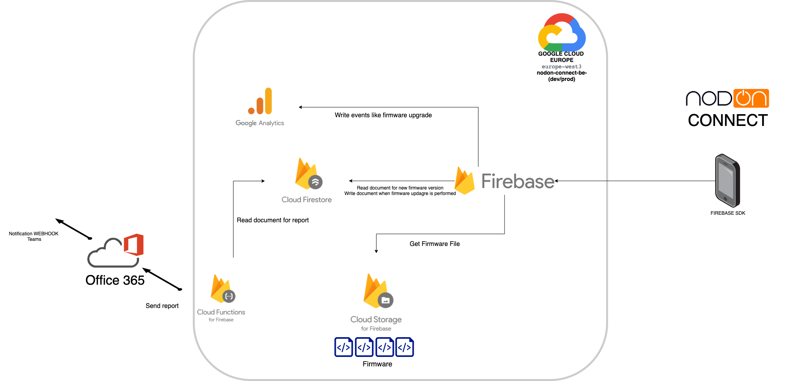
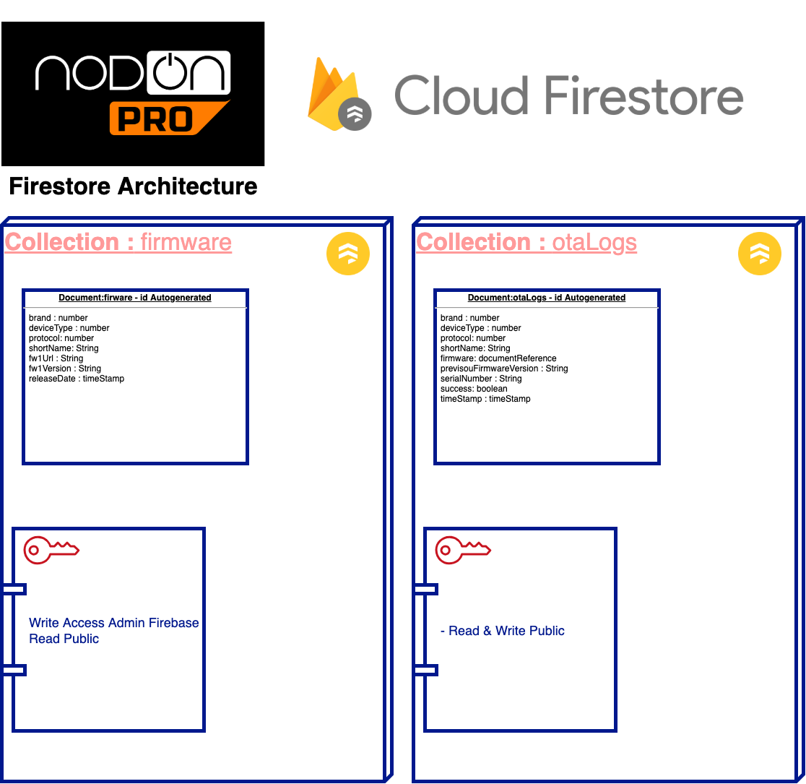

# NODON CONNECT BACKEND -  SPECIFICATIONS 

This document gives an overview of the backend of the SmartPhone app **NodOn Connect** and the services we are using for what purpose.

## ARCHITECTURE 

The backend is hosted on GCP (Google Cloud Platform) and mostly uses various tools offer by Firebase services. 

The list of Firebase services we are using.:

|  Service |  Description  |   
|---|---|
| Cloud Firestore   | Document database type, we use it to store a collection of the different available firmware for each type of product.  |
| Cloud Storage  |  The firmware binary file that is needed to perform the OTA (Update Over the Air) |
| Cloud Functions  | They are cloud functions that will be launch based on an event in Cloud Firestore or base on Specific time frequencies, mostyl for monitoring and logs purposes   |
| Google analytics  |  GA will be used to store specific events of the user actions in the app to monitor the app usage (When an Update is performed if there is an error, etc ...) |

 

**Global Architecture map of the backend related to the Smartphone App "NodOn Connect".**

## Devices

A device advertises pieces of information in the BLE advertising frame, those information is necessary to perform the right query on the Cloud Firestore collection to know if there is a firmware update that needs to be done. Those pieces of information are at least : 

- The type of device
- The brand of the device 
- The protocol of the device 
- The unique ID of the device
- The actual version of the First firmware in the device
- The actual version of the Second firmware in the device
  
  Since the device contains two firmware, it is possible that it's necessary to perform a firmware update twice in a row. 

  ## Cloud Firestore 

  A collection of documents will be used as firmware database.
  Documents will provide informations of the latest available firmware for firmware One and Two for a specific device and its location in Firebase Cloud storage. 

  Once a device is updated a logs collection will be use to store the result of the firmware upgrade. 

  ## Cloud Storage 

  Firmware are stored in Google Cloud storage. Those files are not cached within the application to be sure we upload the latest version each time.

  ## Cloud functions 

  Cloud functions are handle by NodOn, they are use to keep track of the global activities related to devices being scanned and updated. 
  They will probably send some automatic reports into a specific O365 Teams channel so the NodOn Team can get a regular overview. 

  ## Google analytics 

  GA is used to register anonymous events such as a successful device update or failure. 

# 2 -  FIRMWARE UPDATE 

_Firestore Document Architecture_ 

## 2.1 - How an OTA is performed 

Each device contain one or two firmware and with the information available in the advertising frame, the App query a specific collection in Firestore to get the latest firmware. Once the latest firmware has been found, the App must download the binary from the Cloud Storage. 

Once the OTA is done a document is created into a Specific collection of Firestore for logs. 

### 2.1.1 Query Firestore to get the latest firmware 

The firestore collection use to get the latest firmware of a product is the collection : **/firmware** (as show in _Firestore Document Architecture_)

The App MUST query the collection using the brand, deviceType, protocol information from the advertising frame. 

It's possible the query return more than one document in that case : 

- Take the highest Firmware version
- It's possible there is one document for the Firmware 1 and Firmware 2, since some product has two firmware. (_In that case two OTA might be necessary to update the product_)

Then compare the actual firmware version of the product with the firmware version from the firmware document return by the firestore collection.
If the document contain an higher version of the actual version of the Product then we will proceed to the next step. (If the product version is higher than the one in the document, then there is no OTA to be done).

### 2.1.2 Download the firmware binary files from 

From the previous step once the right document has be found with the product firmware information. The document then cotain a key call "**fw1URL**".
The value of the key cotain the relative path to be use to query the cloud firestore bucket in order to get the binary file. 

_Note : Binary file are not store for futur OTA,they are delete after each OTA._

Once you have the OTA binary file, you are all set to perform the OTA. 

## 2.2 - How to log an OTA

Once the OTA is over, the log  result of the process is store in a specific Cloud Firestore collection call "**otaLogs**" as describe above in the document _Firestore Document Architecture_. 

That document is described as follow : 

| key  | type  | description  |
|---|---|---|
|  brand | number   | same information as found in the product advertising frame  |
|  deviceType | number   |  same information as found in the product advertising frame |
|  protocol| number   | same information as found in the product advertising frame  |
|  shortName| String   | same information as found in the product advertising frame  |
|  firmware| documentReference   | The firestore document reference from the collection "firmware" use to perform the OTA  |
|  previsouFirmwareVersion | String   | The previous firmware version of the product that was found in the advertising frame, the format is as follow "X.X.X" Major.Minor.Revision   |
|  serialNumber | String   |   same information as found in the product advertising frame |
|  success| boolean   |  true or false if the OTA worked |
|  timeStamp | timeStamp   | Timestamp of when the OTA has been performed  |

## 2.3 - Update production database 

This IS NOT within the App business scope, but it's important to note that once a otaLogs document has been created , this will launch a cloud function that is going to impact other databases.

